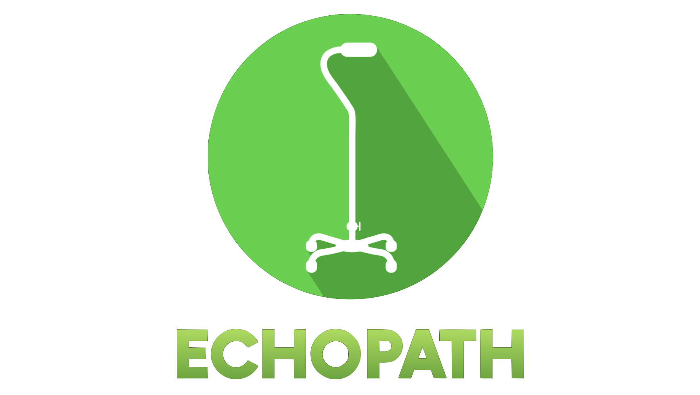

# EchoPath: Smart AI Cane for the Visually Impaired



EchoPath is an innovative project that empowers blind and visually impaired individuals by providing real-time, AI-powered environmental guidance. By combining a finely tuned computer vision model with natural language generation and audible feedback, EchoPath helps users navigate safely and confidently. This project won **Harvard's Makeathon 2025 Most Interactive Design Award**.

---

## Table of Contents

- [EchoPath: Smart AI Cane for the Visually Impaired](#echopath-smart-ai-cane-for-the-visually-impaired)
  - [Table of Contents](#table-of-contents)
  - [Overview](#overview)
  - [Features](#features)
  - [Architecture and Workflow](#architecture-and-workflow)
    - [Canvas Diagram](#canvas-diagram)
  - [GStreamer Issue Fix](#gstreamer-issue-fix)
  - [Setup and Installation](#setup-and-installation)
    - [Prerequisites](#prerequisites)
    - [Installation Steps](#installation-steps)
  - [Usage](#usage)
  - [Project Structure](#project-structure)
  - [Team and Awards](#team-and-awards)
    - [Main Contributors](#main-contributors)
  - [License](#license)

---

## Overview

EchoPath integrates a finely tuned YOLO11n vision model—trained on the COCO128 dataset—with a local Llama 3.2 model (via Ollama) to generate short, concise scene descriptions. The system then uses macOS's built-in `say` command to deliver audible guidance, providing real-time updates to the user through their earbuds.

---

## Features

- **Real-Time Object Detection:**  
  Uses a fine-tuned YOLO11n model (trained on COCO128) to detect objects in live video.

- **Natural Language Generation:**  
  Queries a local Llama 3.2 model to convert detected object lists into clear, 8–10 word sentences.

- **Audible Feedback:**  
  Utilizes macOS’s built-in `say` command to convert text into speech, delivering voice guidance.

- **Live Camera Feed Broadcast:**  
  Supports broadcasting the live camera feed from a Raspberry Pi via GStreamer, which can then be used as a source input to the vision model.

---

## Architecture and Workflow

The system consists of three primary components:

1. **Video Capture & Object Detection:**  
   - A camera captures live video.  
   - The YOLO11n model processes each frame in real time to detect objects.

2. **Language Generation:**  
   - When a change in detected objects is noted, a prompt is sent to a locally hosted Llama 3.2 model using Ollama.  
   - The model returns a concise, natural sentence (8–10 words) describing the scene.

3. **Text-to-Speech (TTS):**  
   - A dedicated TTS worker thread calls macOS’s `say` command to speak the generated sentence, providing real-time audio feedback without interrupting the camera feed.

### Canvas Diagram

Below is an illustrative diagram of the workflow:

```
  [Camera Feed] --> [YOLO11n Object Detection]
                              |
                              v
                 [Detected Object List]
                              |
                              v
                 [Llama 3.2 Language Model]
                              |
                              v
                    [Generated Sentence]
                              |
                              v
                    [macOS 'say' Command]
                              |
                              v
                    [Audible Guidance]
```

---

## GStreamer Issue Fix

When using the Raspberry Pi to broadcast the camera feed via GStreamer (as a source input for the vision model), you might encounter issues with OpenCV's GStreamer backend. Use the following instructions to fix the issue:

```bash
# ON RASPBERRYPI:
libcamera-vid -t 0 --width 1280 --height 720 --framerate 30 --codec h264 -o - | \
gst-launch-1.0 fdsrc ! h264parse ! rtph264pay config-interval=1 pt=96 ! \
udpsink host=<IP ADDRESS> port=5000
# Replace <IP ADDRESS> with the appropriate IP.

# ON YOUR LAPTOP:
gst-launch-1.0 udpsrc port=5000 ! application/x-rtp, encoding-name=H264 ! \
rtph264depay ! avdec_h264 ! videoconvert ! autovideosink

# Fixing GStreamer in OpenCV:
# Navigate to your desired location for the opencv-python repo:
git clone --recursive https://github.com/skvark/opencv-python.git
cd opencv-python
export CMAKE_ARGS="-DWITH_GSTREAMER=ON"
pip install --upgrade pip wheel
# This build step can take from 5 minutes to over 2 hours depending on your hardware.
pip wheel . --verbose
pip install opencv_python*.whl
# Note: The wheel may be generated in the dist/ directory.
```

**Note:** Watch out for the GStreamer issue if you plan to use this feature for broadcasting the live camera feed from the Raspberry Pi to your vision model.

---

## Setup and Installation

### Prerequisites

- **Operating System:** macOS (for TTS using `say` command)  
- **Python:** Version 3.8 or above  
- **Hardware:** Raspberry Pi (optional, for GStreamer broadcast) or a default webcam  
- **Ollama CLI:** Configured to run the `llama3.2:latest` model locally  
- **YOLO Model File:** Fine-tuned YOLO11n model (e.g., `yolo-tuned.pt`) in the `models/` directory

### Installation Steps

1. **Clone the Repository:**
   ```bash
   git clone https://github.com/yourusername/EchoPath.git
   cd EchoPath
   ```

2. **Create and Activate a Virtual Environment:**
   ```bash
   python3 -m venv venv
   source venv/bin/activate
   ```

3. **Install Dependencies:**
   ```bash
   pip install -r requirements.txt
   ```

4. **(Optional) Fix GStreamer Issue:**  
   Follow the steps listed in the [GStreamer Issue Fix](#gstreamer-issue-fix) section if you plan to use a GStreamer pipeline.

---

## Usage

1. **Run the Application:**
   ```bash
   python client-ollama2.py
   ```
   (Alternatively, run `main.py` if that is your main file.)

2. **Operation:**
   - The application opens a window with a live video feed.
   - It continuously processes frames, detects objects with the fine-tuned YOLO11n model, and queries the Llama 3.2 model when changes occur.
   - The generated description is spoken using macOS's `say` command.
   - Press `q` in the display window to exit the application.

---

## Project Structure

```
EchoPath/
├── .git/                    # Git repository files
├── README.md                # Project documentation (this file)
├── assets/                  # Project assets (images, icons, etc.)
├── datasets/                # Data for training or testing
├── main.py                  # Main application code
├── models/                  # YOLO model files (fine-tuned YOLO11n on COCO128)
├── opencv-python/           # Custom OpenCV Python build (if used)
├── requirements.txt         # Python package dependencies
└── voices.txt               # List of available voices (optional)
```

---

## Team and Awards

- **Team Name:** EchoPath  
- **Awards:** Winner of **Harvard's Makeathon 2025 Most Interactive Design Award**

### Main Contributors

- **Taha Ababou**: [GitHub](https://github.com/tahababou12) [LinkedIn](https://www.linkedin.com/in/tahaababou/)
- **Aditya Rampal**: [GitHub](https://github.com/ROBOADI26) [LinkedIn](https://www.linkedin.com/in/adityarampal11/)
- **Anton Garcia Abril Beca**: [GitHub](https://github.com/tonchoponcho) [LinkedIn](https://www.linkedin.com/in/anton-garcia-abril-beca/)
- **Jake Garrett**: [GitHub](https://github.com/jacobpgarrett) [LinkedIn](https://www.linkedin.com/in/jake-garrett-374a29180/)
---

## License

This project is open-source and available under the [MIT License](LICENSE).
